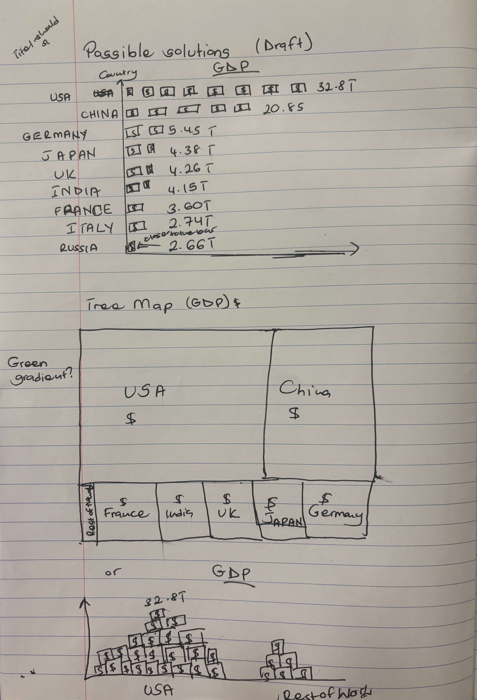
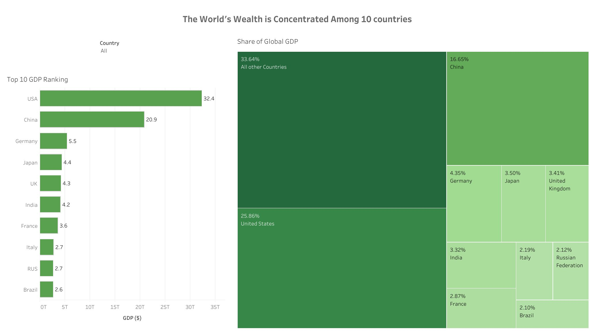

| [home page](https://cmustudent.github.io/tswd-portfolio-templates/) | [data viz examples](dataviz-examples) | [critique by design](critique-by-design) | [final project I](final-project-part-one) | [final project II](final-project-part-two) | [final project III](final-project-part-three) |

# Global GDP Rankings
For this assignment, I redesigned a visualization of the Top 10 GDPs ranked. 

## Step one: the visualization
The [original version] (https://makeovermonday.vercel.app/submissions/2026/34) was very cut and dry. Just a table showing ranked GDPs and share of global GDP. Given that the original visualization is on a page that is targeted towards people, seemingly professionals looking for statistics of different kinds, I understood the need for simplicity but really wanted to play around with creativity. 

I chose this visualization because of my interest in economic development.

## Step two: the critique
More than anything, I felt that the visualization did not use any tools to improve comprehension. There was no color and no visual elements. Yes the audience is most likely technical professionals looking for specific information, but the absolute lack of visual elements did not properly express the magnitude of GDP share held by the top 10 countries and the takeaways. I wanted to help the audience visualize and properly understand just how much GDP wealth these 10 countries have in comparison to all other countries of the world. 

## Step three: Sketch a solution
My initial ideas were pretty lofty. The central theme was to use a dollar bill as a visual representation of millions or billions of dollars to show just how much each country has. 

The other challenge was visualizing GDP share held by each country. 

I chose to create three rough draft ideas. 

## Step four: Test the solution
I tested my solution amongst four peers pursuing Masters degrees at Heinz college. Because I wanted to take a more creative approach, I was scared I was created what I wanted not what the audience needed. 

All four of my peer reviewers seemed to point to one thing: Simplify! Simplify! Simplify!

*Ernest asked whether my use of money as a visual symbol was necessary for the audience in question. It would be great for students in elementary school but for a technical audience? 

*Ananda expressed concern with the tree map and warned it could be confusing if it is only focused on the top 10 questions as tree maps usually show parts of a whole. Only showing the 10 could misrepresent the 10 as a whole. 

Outside of these particular points, the suggestion was to use a more familiar graph type and use green as a color to indicate money.

*pseudonym

## Step five: build the solution

So I went back to the drawing board with the realization that in this case, less is more. 

I fixed my sights on a dashboard with a tree map and a bar chart. Both very simple and yet effective. 

For the tree map, I created a group within Tableau for 'All other countries'. This allowed me to include their share of GDP without over crowding the tree map. Noticeably this is the largest share, but in context that section is an aggregation of GDP data from more than 180 countries. 

For the Bar graph, I ranked the GDP in descending order and included labels at the end to make readability easy. 

The dashboard has a filter to enable easy 'zooming in' on one or a few countries. 

<iframe 
src"https://public.tableau.com/views/ChevonneKwarisiima_MakeoverMondayFinal/FinalDashboard?:showVizHome=no&:embed=true" width="90%" height="500" seamless frameborder="0" scrolling="no"></iframe>

